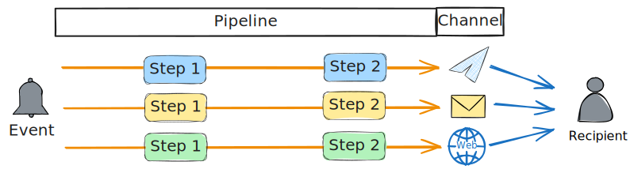

# What is Notifico
**Notifico** is an advanced omni-channel notification server.

Notifico is a powerful and flexible notification system that supports a wide range of communication channels, including [email](channels/smtp.md), [SMS](channels/smpp.md), and popular messaging platforms like [Telegram](channels/telegram.md). It provides a unified interface for sending notifications across these diverse channels, allowing you to reach your users through their preferred communication methods. With Notifico, you can easily integrate and manage multiple notification channels within your application, ensuring that your messages are delivered efficiently and effectively to your target audience.

Just a single [API call](api.md), and you are all set!

## Key concepts

### Pipelines
Pipelines are sequences of processing steps that a notification goes through before being delivered. They allow you to apply transformations, filters, and enrichments to your notifications. With Notifico, you can design custom pipelines to ensure that each notification is processed according to your specific business rules and requirements. This feature provides flexibility and control over how notifications are handled and delivered.

### Notifications
Notifications are messages that are sent to users or systems to inform them of events, updates, or actions that require their attention. Notifico allows you to send notifications through various channels such as email, SMS, and messengers.

### Channels
Channels are the mediums through which notifications are delivered. Notifico supports multiple channels, enabling you to reach your users wherever they are. You can configure and manage these channels to suit your application's needs.

### Templates
Templates are predefined formats for your notifications. They allow you to maintain consistency in your messaging and save time by reusing common structures. Notifico supports dynamic content in templates, enabling personalized notifications.

### Events
Events are triggers that initiate the sending of notifications. They can be based on user actions, system changes, or scheduled times. Notifico allows you to define and manage events to automate your notification workflows.
