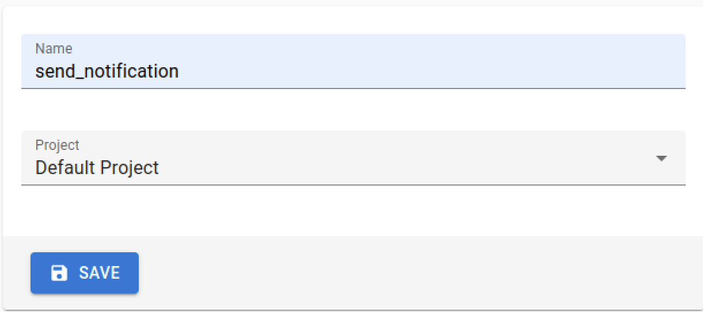
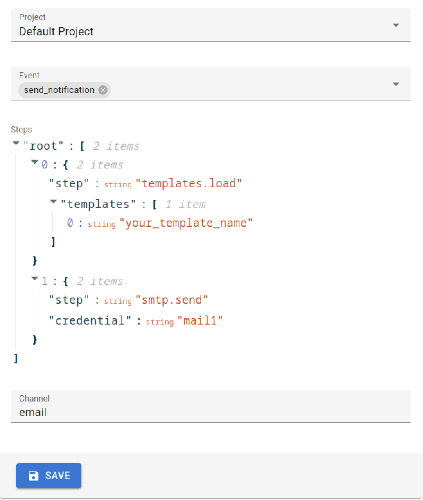

# Pipeline

A pipeline in Notifico is a structured sequence of operations that processes incoming events and sends notifications to specified channels.
It acts as a workflow that defines how data flows through the system, from the moment an event is triggered to the final delivery of a notification.

Each pipeline consists of a channel, events, and steps.

## Key Components of a Pipeline

### Events

- Events are the triggers that initiate the execution of a pipeline.
They represent specific occurrences or conditions that require a response, such as a new user registration or a system alert.
- In the configuration, events are defined with a unique name, and pipelines are associated with these events to specify what actions should be taken when the event occurs.

#### Creating an event
Go to the "Events" section in your admin panel, click "+ Create". Select Project (Default Project) and enter a name for your event.
This name will be used later in pipeline editor and when calling an API to trigger the notification.

??? example "Screenshot"
    

### Channels

- Channels are the mediums through which notifications are sent. Common channels include email, SMS, and messaging platforms like Telegram.
- Each pipeline is associated with a channel, determining where the notifications will be delivered and which template will be rendered.
- Each channel has a string identifier, which is cocumented in the channel's corresponding section of this documentation. **Examples:** `email`, `sms`, `slack`

### Steps

Steps define the actions to be performed in each pipeline. In the example above, there are two steps for each channel:

1. `templates.load`: This step loads template files specified in the `templates` array.
2. `telegram.send` or `smtp.send`: These steps send notifications to the respective channels using the credentials specified.

### Credentials

- Credentials are used to authenticate with external services required by the pipeline, such as email servers or messaging APIs.
- They are defined separately using environment variables, and referenced in the pipeline configuration to ensure secure communication with external systems.

## Creating a Pipeline

To create a pipeline in Notifico, you can use the admin panel, which provides a user-friendly interface for defining and managing your pipelines. Follow these steps to create a new pipeline:

1. **Access the Admin Panel**:
      - Log in to your Notifico admin panel.
      - Navigate to the "Pipelines" section.

2. **Create a New Pipeline**:
      - Click on the "+ Create" button to start a new pipeline configuration.
      - You will be prompted to enter details for your pipeline, including the channel, events, and steps.

3. **Configure the Pipeline**:
      - **Select a Channel**: Choose the channel through which notifications will be sent. This could be email, SMS, or any other supported platform.
      - **Add Events**: Select or create events that will trigger this pipeline. These events should be defined in the "Events" section of the admin panel.
      - **Define Steps**: Specify the sequence of actions to be performed. This includes loading templates and sending notifications using the appropriate credentials.
        The JSON editor is not very convenient right now. A new editor will be available in the following releases.

4. **Save the Pipeline**:
      - Once you have configured all the necessary parts, save the pipeline.
      - The pipeline will now be active and ready to process events as per your configuration.

By following these steps, you can efficiently create and manage pipelines to handle various notification workflows in Notifico.
The screenshot above provides a visual example of the pipeline creation interface in the admin panel.
